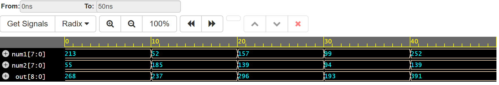

# uvm-tutorial

https://www.edaplayground.com/x/Vknb



## Doğrulama Adımları

1. Packet Tanımlanır
2. Packet'tan sequence oluşturulur ve sequence içerisinde body task packetin nasıl sürüleceğini belirtir.
  - Driver sequencera run_phase'te seq_item_port.get_next_item(req) üzerinden istek oluşturduğunda sequencer bu sequence'e uvm_do operasyonu ile packeti oluşturup göndermesini ister.
3. Driver virtual interface ile connect_phase bağlanır ve virtual interface üzerinden sequencerdan gelen sequnece'i sürer.
4. Monitor'de virtual interface'de ki veri trafiğini run_phase'te görüntülemek için bu virtual interface'e bağlanır.
5. Monitor ek olarak bir TLM portu ile scoreboarda bağlıdır vebu port üzerinden virtual interface'de gözlemlediği verileri iletir.
6. Driver ve sequencer bağlantısı agent'ta yapılır.
7. Environment'ta agent ve scoreboard örneklenir ve agent içerisinde örneklenen monitor ile scoreboard TLB bağlantısı connect_phase'da bağlanır.
8. Scoreboard golden modeli barındırır ve monitor izleme verileri ile kendi verilerini kıyaslar.
9. Test sınıfınca çalıştırılacak testler ve default test gibi ya da sistem bazında bazı yapılandırmalar yapılır.
10. Top modülde run_test ile phase aşamaları başlatılır.

```log
# UVM_INFO /usr/share/questa/questasim/verilog_src/questa_uvm_pkg-1.2/src/questa_uvm_pkg.sv(277) @ 0: reporter [Questa UVM] QUESTA_UVM-1.2.3
# UVM_INFO /usr/share/questa/questasim/verilog_src/questa_uvm_pkg-1.2/src/questa_uvm_pkg.sv(278) @ 0: reporter [Questa UVM]  questa_uvm::init(+struct)
# UVM_INFO @ 0: reporter [RNTST] Running test base_test...
# UVM_INFO /usr/share/questa/questasim/verilog_src/uvm-1.2/src/base/uvm_root.svh(579) @ 0: reporter [UVMTOP] UVM testbench topology:
# --------------------------------------------------------------------
# Name                       Type                     Size  Value     
# --------------------------------------------------------------------
# uvm_test_top               base_test                -     @360      
#   env                      adder_env                -     @374      
#     agent                  adder_agent              -     @386      
#       driver               adder_driver             -     @555      
#         rsp_port           uvm_analysis_port        -     @572      
#         seq_item_port      uvm_seq_item_pull_port   -     @563      
#       monitor              adder_monitor            -     @415      
#         adder_send         uvm_analysis_port        -     @423      
#       sequencer            adder_sequencer          -     @432      
#         rsp_export         uvm_analysis_export      -     @440      
#         seq_item_export    uvm_seq_item_pull_imp    -     @546      
#         arbitration_queue  array                    0     -         
#         lock_queue         array                    0     -         
#         num_last_reqs      integral                 32    'd1       
#         num_last_rsps      integral                 32    'd1       
#       is_active            uvm_active_passive_enum  1     UVM_ACTIVE
#     sb                     adder_scoreboard         -     @394      
#       adder_mon            uvm_analysis_imp         -     @402      
# --------------------------------------------------------------------
# 
# UVM_INFO adder_monitor.sv(85) @ 0: uvm_test_top.env.agent.monitor [adder_monitor] Inside the run_phase
# UVM_INFO adder_sequence.sv(54) @ 0: uvm_test_top.env.agent.sequencer@@adder_base_seq [adder_base_seq] raise objection
# UVM_INFO adder_sequence.sv(38) @ 0: uvm_test_top.env.agent.sequencer@@adder_base_seq [adder_base_seq] Executing adder_packets sequence
# UVM_INFO adder_driver.sv(79) @ 0: uvm_test_top.env.agent.driver [adder_driver] Adder response received
# UVM_INFO adder_scoreboard.sv(75) @ 10: uvm_test_top.env.sb [adder_scoreboard] TEST PASSED: 213 +  55 = 268
# ---------------------------------
# Name    Type          Size  Value
# ---------------------------------
# packet  adder_packet  -     @581 
#   num1  integral      8     'hd5 
#   num2  integral      8     'h37 
# ---------------------------------
# --------------------------------------------------------------------------------------------------
# Name                           Type          Size  Value                                          
# --------------------------------------------------------------------------------------------------
# req                            adder_packet  -     @626                                           
#   num1                         integral      8     'hd5                                           
#   num2                         integral      8     'h37                                           
#   begin_time                   time          64    0                                              
#   depth                        int           32    'd2                                            
#   parent sequence (name)       string        14    adder_base_seq                                 
#   parent sequence (full name)  string        47    uvm_test_top.env.agent.sequencer.adder_base_seq
#   sequencer                    string        32    uvm_test_top.env.agent.sequencer               
# --------------------------------------------------------------------------------------------------
# UVM_INFO adder_driver.sv(79) @ 10: uvm_test_top.env.agent.driver [adder_driver] Adder response received
# UVM_INFO adder_scoreboard.sv(75) @ 20: uvm_test_top.env.sb [adder_scoreboard] TEST PASSED:  52 + 185 = 237
# ---------------------------------
# Name    Type          Size  Value
# ---------------------------------
# packet  adder_packet  -     @581 
#   num1  integral      8     'h34 
#   num2  integral      8     'hb9 
# ---------------------------------
# --------------------------------------------------------------------------------------------------
# Name                           Type          Size  Value                                          
# --------------------------------------------------------------------------------------------------
# req                            adder_packet  -     @660                                           
#   num1                         integral      8     'h34                                           
#   num2                         integral      8     'hb9                                           
#   begin_time                   time          64    10                                             
#   depth                        int           32    'd2                                            
#   parent sequence (name)       string        14    adder_base_seq                                 
#   parent sequence (full name)  string        47    uvm_test_top.env.agent.sequencer.adder_base_seq
#   sequencer                    string        32    uvm_test_top.env.agent.sequencer               
# --------------------------------------------------------------------------------------------------
# UVM_INFO adder_driver.sv(79) @ 20: uvm_test_top.env.agent.driver [adder_driver] Adder response received
# UVM_INFO adder_scoreboard.sv(75) @ 30: uvm_test_top.env.sb [adder_scoreboard] TEST PASSED: 157 + 139 = 296
# ---------------------------------
# Name    Type          Size  Value
# ---------------------------------
# packet  adder_packet  -     @581 
#   num1  integral      8     'h9d 
#   num2  integral      8     'h8b 
# ---------------------------------
# --------------------------------------------------------------------------------------------------
# Name                           Type          Size  Value                                          
# --------------------------------------------------------------------------------------------------
# req                            adder_packet  -     @668                                           
#   num1                         integral      8     'h9d                                           
#   num2                         integral      8     'h8b                                           
#   begin_time                   time          64    20                                             
#   depth                        int           32    'd2                                            
#   parent sequence (name)       string        14    adder_base_seq                                 
#   parent sequence (full name)  string        47    uvm_test_top.env.agent.sequencer.adder_base_seq
#   sequencer                    string        32    uvm_test_top.env.agent.sequencer               
# --------------------------------------------------------------------------------------------------
# UVM_INFO adder_driver.sv(79) @ 30: uvm_test_top.env.agent.driver [adder_driver] Adder response received
# UVM_INFO adder_scoreboard.sv(75) @ 40: uvm_test_top.env.sb [adder_scoreboard] TEST PASSED:  99 +  94 = 193
# ---------------------------------
# Name    Type          Size  Value
# ---------------------------------
# packet  adder_packet  -     @581 
#   num1  integral      8     'h63 
#   num2  integral      8     'h5e 
# ---------------------------------
# --------------------------------------------------------------------------------------------------
# Name                           Type          Size  Value                                          
# --------------------------------------------------------------------------------------------------
# req                            adder_packet  -     @676                                           
#   num1                         integral      8     'h63                                           
#   num2                         integral      8     'h5e                                           
#   begin_time                   time          64    30                                             
#   depth                        int           32    'd2                                            
#   parent sequence (name)       string        14    adder_base_seq                                 
#   parent sequence (full name)  string        47    uvm_test_top.env.agent.sequencer.adder_base_seq
#   sequencer                    string        32    uvm_test_top.env.agent.sequencer               
# --------------------------------------------------------------------------------------------------
# UVM_INFO adder_driver.sv(79) @ 40: uvm_test_top.env.agent.driver [adder_driver] Adder response received
# UVM_INFO adder_scoreboard.sv(75) @ 50: uvm_test_top.env.sb [adder_scoreboard] TEST PASSED: 252 + 139 = 391
# ---------------------------------
# Name    Type          Size  Value
# ---------------------------------
# packet  adder_packet  -     @581 
#   num1  integral      8     'hfc 
#   num2  integral      8     'h8b 
# ---------------------------------
# --------------------------------------------------------------------------------------------------
# Name                           Type          Size  Value                                          
# --------------------------------------------------------------------------------------------------
# req                            adder_packet  -     @684                                           
#   num1                         integral      8     'hfc                                           
#   num2                         integral      8     'h8b                                           
#   begin_time                   time          64    40                                             
#   depth                        int           32    'd2                                            
#   parent sequence (name)       string        14    adder_base_seq                                 
#   parent sequence (full name)  string        47    uvm_test_top.env.agent.sequencer.adder_base_seq
#   sequencer                    string        32    uvm_test_top.env.agent.sequencer               
# --------------------------------------------------------------------------------------------------
# UVM_INFO adder_sequence.sv(69) @ 50: uvm_test_top.env.agent.sequencer@@adder_base_seq [adder_base_seq] drop objection
# UVM_INFO /usr/share/questa/questasim/verilog_src/uvm-1.2/src/base/uvm_objection.svh(1270) @ 50: reporter [TEST_DONE] 'run' phase is ready to proceed to the 'extract' phase
# UVM_INFO /usr/share/questa/questasim/verilog_src/uvm-1.2/src/base/uvm_report_server.svh(847) @ 50: reporter [UVM/REPORT/SERVER] 
# --- UVM Report Summary ---
# 
# ** Report counts by severity
# UVM_INFO :   20
# UVM_WARNING :    0
# UVM_ERROR :    0
# UVM_FATAL :    0
# ** Report counts by id
# [Questa UVM]     2
# [RNTST]     1
# [TEST_DONE]     1
# [UVM/RELNOTES]     1
# [UVMTOP]     1
# [adder_base_seq]     3
# [adder_driver]     5
# [adder_monitor]     1
# [adder_scoreboard]     5
# 
# ** Note: $finish    : /usr/share/questa/questasim/verilog_src/uvm-1.2/src/base/uvm_root.svh(517)
#    Time: 50 ns  Iteration: 77  Instance: /top
# End time: 17:10:33 on Feb 07,2025, Elapsed time: 0:00:03
# Errors: 0, Warnings: 0
End time: 17:10:33 on Feb 07,2025, Elapsed time: 0:00:16
*** Summary *********************************************
    qrun: Errors:   0, Warnings:   0
    vlog: Errors:   0, Warnings:   0
    vopt: Errors:   0, Warnings:   1
    vsim: Errors:   0, Warnings:   0
  Totals: Errors:   0, Warnings:   1
```